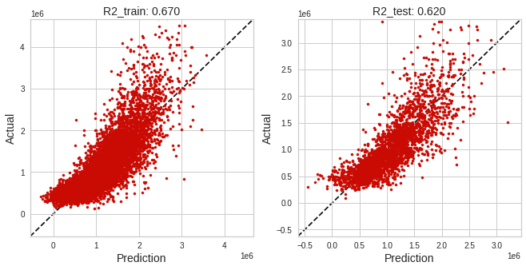

#  Melbourne Housing Marketing

Data taken from kaggle https://www.kaggle.com/dansbecker/melbourne-housing-snapshot

# Features Information

Suburb: Suburb

Address: Address

Rooms: Number of rooms

Price: Price in dollars

Method: S - property sold; SP - property sold prior; PI - property passed in; PN - sold prior not disclosed; SN - sold not disclosed; NB - no bid; VB - vendor bid; W - withdrawn prior to auction; SA - sold after auction; SS - sold after auction price not disclosed. N/A - price or highest bid not available.

Type: br - bedroom(s); h - house,cottage,villa, semi,terrace; u - unit, duplex; t - townhouse; dev site - development site; o res - other residential.

SellerG: Real Estate Agent

Date: Date sold

Distance: Distance from CBD

Regionname: General Region (West, North West, North, North east ...etc)

Propertycount: Number of properties that exist in the suburb.

Bedroom2 : Scraped # of Bedrooms (from different source)

Bathroom: Number of Bathrooms

Car: Number of carspots

Landsize: Land Size

BuildingArea: Building Size

YearBuilt: Year the house was built

CouncilArea: Governing council for the area

Lattitude: Self explanitory

Longtitude: Self explanitory


```python
import numpy as np
import seaborn as sns
import pandas as pd
import matplotlib.pyplot as plt
import scipy.stats as ss

from sklearn.model_selection import train_test_split
from sklearn.pipeline import Pipeline
from sklearn.compose import ColumnTransformer
from xgboost import XGBRegressor
from sklearn.preprocessing import RobustScaler, OneHotEncoder, PolynomialFeatures,PowerTransformer, FunctionTransformer

from jcopml.feature_importance import mean_score_decrease
from jcopml.plot import plot_actual_vs_prediction, plot_residual
from jcopml.tuning.space import Real, Integer

from yellowbrick.model_selection import LearningCurve, ValidationCurve
from yellowbrick.regressor import prediction_error
from yellowbrick.regressor import ResidualsPlot
from sklearn.model_selection import GridSearchCV, RandomizedSearchCV


import scipy.stats as ss
from statsmodels.stats.outliers_influence import variance_inflation_factor
from statsmodels.tools.tools import add_constant
from sklearn.neighbors import KernelDensity
from scipy.stats import mannwhitneyu, chi2_contingency
from scipy.stats import shapiro, spearmanr

import warnings
warnings.filterwarnings("ignore")
```


```python
#Correlation measurement untuk data discrete dan continous
def correlation_ratio(categories, measurement):
    fcat,_ = pd.factorize(categories)
    cat_num = np.max(fcat)+1
    y_avg_array = np.zeros(cat_num)
    n_array = np.zeros(cat_num)
    for i in range(0, cat_num):
        cat_measures = measurement[np.argwhere(fcat == i).flatten()]
        n_array[i] = len(cat_measures)
        y_avg_array[i] = np.average(cat_measures)
    y_total_avg = np.sum(np.multiply(y_avg_array,n_array))/np.sum(n_array)
    numerator = np.sum(np.multiply(n_array,np.power(np.subtract(y_avg_array, y_total_avg),2)))
    denominator = np.sum(np.power(np.subtract(measurement,y_total_avg),2))
    if numerator == 0:
        eta = 0.0
    else:
        eta = np.sqrt(numerator/denominator)
    return eta

#Correlation measurement untuk data discrete dan discrete
def cramers_v(x, y):
    confusion_matrix = pd.crosstab(x,y)
    chi2 = ss.chi2_contingency(confusion_matrix)[0]
    n = confusion_matrix.sum().sum()
    phi2 = chi2/n
    r,k = confusion_matrix.shape
    phi2corr = max(0, phi2-((k-1)*(r-1))/(n-1))
    rcorr = r - ((r-1)**2)/(n-1)
    kcorr = k - ((k-1)**2)/(n-1)
    return np.sqrt(phi2corr/min((kcorr-1),(rcorr-1)))
```


```python
melb = pd.read_csv('melb_data.csv')
```


```python
melb.head()
```


<div>
<style scoped>
    .dataframe tbody tr th:only-of-type {
        vertical-align: middle;
    }

    .dataframe tbody tr th {
        vertical-align: top;
    }

    .dataframe thead th {
        text-align: right;
    }
</style>
<table border="1" class="dataframe">
  <thead>
    <tr style="text-align: right;">
      <th></th>
      <th>Suburb</th>
      <th>Address</th>
      <th>Rooms</th>
      <th>Type</th>
      <th>Price</th>
      <th>Method</th>
      <th>SellerG</th>
      <th>Date</th>
      <th>Distance</th>
      <th>Postcode</th>
      <th>...</th>
      <th>Bathroom</th>
      <th>Car</th>
      <th>Landsize</th>
      <th>BuildingArea</th>
      <th>YearBuilt</th>
      <th>CouncilArea</th>
      <th>Lattitude</th>
      <th>Longtitude</th>
      <th>Regionname</th>
      <th>Propertycount</th>
    </tr>
  </thead>
  <tbody>
    <tr>
      <th>0</th>
      <td>Abbotsford</td>
      <td>85 Turner St</td>
      <td>2</td>
      <td>h</td>
      <td>1480000.0</td>
      <td>S</td>
      <td>Biggin</td>
      <td>3/12/2016</td>
      <td>2.5</td>
      <td>3067.0</td>
      <td>...</td>
      <td>1.0</td>
      <td>1.0</td>
      <td>202.0</td>
      <td>NaN</td>
      <td>NaN</td>
      <td>Yarra</td>
      <td>-37.7996</td>
      <td>144.9984</td>
      <td>Northern Metropolitan</td>
      <td>4019.0</td>
    </tr>
    <tr>
      <th>1</th>
      <td>Abbotsford</td>
      <td>25 Bloomburg St</td>
      <td>2</td>
      <td>h</td>
      <td>1035000.0</td>
      <td>S</td>
      <td>Biggin</td>
      <td>4/02/2016</td>
      <td>2.5</td>
      <td>3067.0</td>
      <td>...</td>
      <td>1.0</td>
      <td>0.0</td>
      <td>156.0</td>
      <td>79.0</td>
      <td>1900.0</td>
      <td>Yarra</td>
      <td>-37.8079</td>
      <td>144.9934</td>
      <td>Northern Metropolitan</td>
      <td>4019.0</td>
    </tr>
    <tr>
      <th>2</th>
      <td>Abbotsford</td>
      <td>5 Charles St</td>
      <td>3</td>
      <td>h</td>
      <td>1465000.0</td>
      <td>SP</td>
      <td>Biggin</td>
      <td>4/03/2017</td>
      <td>2.5</td>
      <td>3067.0</td>
      <td>...</td>
      <td>2.0</td>
      <td>0.0</td>
      <td>134.0</td>
      <td>150.0</td>
      <td>1900.0</td>
      <td>Yarra</td>
      <td>-37.8093</td>
      <td>144.9944</td>
      <td>Northern Metropolitan</td>
      <td>4019.0</td>
    </tr>
    <tr>
      <th>3</th>
      <td>Abbotsford</td>
      <td>40 Federation La</td>
      <td>3</td>
      <td>h</td>
      <td>850000.0</td>
      <td>PI</td>
      <td>Biggin</td>
      <td>4/03/2017</td>
      <td>2.5</td>
      <td>3067.0</td>
      <td>...</td>
      <td>2.0</td>
      <td>1.0</td>
      <td>94.0</td>
      <td>NaN</td>
      <td>NaN</td>
      <td>Yarra</td>
      <td>-37.7969</td>
      <td>144.9969</td>
      <td>Northern Metropolitan</td>
      <td>4019.0</td>
    </tr>
    <tr>
      <th>4</th>
      <td>Abbotsford</td>
      <td>55a Park St</td>
      <td>4</td>
      <td>h</td>
      <td>1600000.0</td>
      <td>VB</td>
      <td>Nelson</td>
      <td>4/06/2016</td>
      <td>2.5</td>
      <td>3067.0</td>
      <td>...</td>
      <td>1.0</td>
      <td>2.0</td>
      <td>120.0</td>
      <td>142.0</td>
      <td>2014.0</td>
      <td>Yarra</td>
      <td>-37.8072</td>
      <td>144.9941</td>
      <td>Northern Metropolitan</td>
      <td>4019.0</td>
    </tr>
  </tbody>
</table>
<p>5 rows × 21 columns</p>
</div>


```python
pd.DataFrame({'dataFeatures' : melb.columns, 'dataType' : melb.dtypes.values, 
              'null' : [melb[i].isna().sum() for i in melb.columns],
              'nullPct' : [((melb[i].isna().sum()/len(melb[i]))*100).round(2) for i in melb.columns],
             'Nunique' : [melb[i].nunique() for i in melb.columns],
             'uniqueSample' : [list(pd.Series(melb[i].unique()).sample(2)) for i in melb.columns]}).reset_index(drop = True)
```


<div>
<style scoped>
    .dataframe tbody tr th:only-of-type {
        vertical-align: middle;
    }

    .dataframe tbody tr th {
        vertical-align: top;
    }

    .dataframe thead th {
        text-align: right;
    }
</style>
<table border="1" class="dataframe">
  <thead>
    <tr style="text-align: right;">
      <th></th>
      <th>dataFeatures</th>
      <th>dataType</th>
      <th>null</th>
      <th>nullPct</th>
      <th>Nunique</th>
      <th>uniqueSample</th>
    </tr>
  </thead>
  <tbody>
    <tr>
      <th>0</th>
      <td>Suburb</td>
      <td>object</td>
      <td>0</td>
      <td>0.00</td>
      <td>314</td>
      <td>[Carrum, Mount Evelyn]</td>
    </tr>
    <tr>
      <th>1</th>
      <td>Address</td>
      <td>object</td>
      <td>0</td>
      <td>0.00</td>
      <td>13378</td>
      <td>[4/8 Park St, 99 Peppercorn Pde]</td>
    </tr>
    <tr>
      <th>2</th>
      <td>Rooms</td>
      <td>int64</td>
      <td>0</td>
      <td>0.00</td>
      <td>9</td>
      <td>[4, 8]</td>
    </tr>
    <tr>
      <th>3</th>
      <td>Type</td>
      <td>object</td>
      <td>0</td>
      <td>0.00</td>
      <td>3</td>
      <td>[h, u]</td>
    </tr>
    <tr>
      <th>4</th>
      <td>Price</td>
      <td>float64</td>
      <td>0</td>
      <td>0.00</td>
      <td>2204</td>
      <td>[692500.0, 920000.0]</td>
    </tr>
    <tr>
      <th>5</th>
      <td>Method</td>
      <td>object</td>
      <td>0</td>
      <td>0.00</td>
      <td>5</td>
      <td>[SP, VB]</td>
    </tr>
    <tr>
      <th>6</th>
      <td>SellerG</td>
      <td>object</td>
      <td>0</td>
      <td>0.00</td>
      <td>268</td>
      <td>[Darras, Nguyen]</td>
    </tr>
    <tr>
      <th>7</th>
      <td>Date</td>
      <td>object</td>
      <td>0</td>
      <td>0.00</td>
      <td>58</td>
      <td>[23/04/2016, 3/12/2016]</td>
    </tr>
    <tr>
      <th>8</th>
      <td>Distance</td>
      <td>float64</td>
      <td>0</td>
      <td>0.00</td>
      <td>202</td>
      <td>[34.7, 3.1]</td>
    </tr>
    <tr>
      <th>9</th>
      <td>Postcode</td>
      <td>float64</td>
      <td>0</td>
      <td>0.00</td>
      <td>198</td>
      <td>[3074.0, 3078.0]</td>
    </tr>
    <tr>
      <th>10</th>
      <td>Bedroom2</td>
      <td>float64</td>
      <td>0</td>
      <td>0.00</td>
      <td>12</td>
      <td>[1.0, 2.0]</td>
    </tr>
    <tr>
      <th>11</th>
      <td>Bathroom</td>
      <td>float64</td>
      <td>0</td>
      <td>0.00</td>
      <td>9</td>
      <td>[1.0, 8.0]</td>
    </tr>
    <tr>
      <th>12</th>
      <td>Car</td>
      <td>float64</td>
      <td>62</td>
      <td>0.46</td>
      <td>11</td>
      <td>[6.0, nan]</td>
    </tr>
    <tr>
      <th>13</th>
      <td>Landsize</td>
      <td>float64</td>
      <td>0</td>
      <td>0.00</td>
      <td>1448</td>
      <td>[17.0, 864.0]</td>
    </tr>
    <tr>
      <th>14</th>
      <td>BuildingArea</td>
      <td>float64</td>
      <td>6450</td>
      <td>47.50</td>
      <td>602</td>
      <td>[88.0, 266.53]</td>
    </tr>
    <tr>
      <th>15</th>
      <td>YearBuilt</td>
      <td>float64</td>
      <td>5375</td>
      <td>39.58</td>
      <td>144</td>
      <td>[1913.0, 1983.0]</td>
    </tr>
    <tr>
      <th>16</th>
      <td>CouncilArea</td>
      <td>object</td>
      <td>1369</td>
      <td>10.08</td>
      <td>33</td>
      <td>[Cardinia, Casey]</td>
    </tr>
    <tr>
      <th>17</th>
      <td>Lattitude</td>
      <td>float64</td>
      <td>0</td>
      <td>0.00</td>
      <td>6503</td>
      <td>[-37.85102, -37.9263]</td>
    </tr>
    <tr>
      <th>18</th>
      <td>Longtitude</td>
      <td>float64</td>
      <td>0</td>
      <td>0.00</td>
      <td>7063</td>
      <td>[144.87205, 145.025]</td>
    </tr>
    <tr>
      <th>19</th>
      <td>Regionname</td>
      <td>object</td>
      <td>0</td>
      <td>0.00</td>
      <td>8</td>
      <td>[Southern Metropolitan, Western Metropolitan]</td>
    </tr>
    <tr>
      <th>20</th>
      <td>Propertycount</td>
      <td>float64</td>
      <td>0</td>
      <td>0.00</td>
      <td>311</td>
      <td>[14042.0, 11308.0]</td>
    </tr>
  </tbody>
</table>
</div>


```python
melb.describe()
```


<div>
<style scoped>
    .dataframe tbody tr th:only-of-type {
        vertical-align: middle;
    }

    .dataframe tbody tr th {
        vertical-align: top;
    }

    .dataframe thead th {
        text-align: right;
    }
</style>
<table border="1" class="dataframe">
  <thead>
    <tr style="text-align: right;">
      <th></th>
      <th>Rooms</th>
      <th>Price</th>
      <th>Distance</th>
      <th>Postcode</th>
      <th>Bedroom2</th>
      <th>Bathroom</th>
      <th>Car</th>
      <th>Landsize</th>
      <th>BuildingArea</th>
      <th>YearBuilt</th>
      <th>Lattitude</th>
      <th>Longtitude</th>
      <th>Propertycount</th>
    </tr>
  </thead>
  <tbody>
    <tr>
      <th>count</th>
      <td>13580.000000</td>
      <td>1.358000e+04</td>
      <td>13580.000000</td>
      <td>13580.000000</td>
      <td>13580.000000</td>
      <td>13580.000000</td>
      <td>13518.000000</td>
      <td>13580.000000</td>
      <td>7130.000000</td>
      <td>8205.000000</td>
      <td>13580.000000</td>
      <td>13580.000000</td>
      <td>13580.000000</td>
    </tr>
    <tr>
      <th>mean</th>
      <td>2.937997</td>
      <td>1.075684e+06</td>
      <td>10.137776</td>
      <td>3105.301915</td>
      <td>2.914728</td>
      <td>1.534242</td>
      <td>1.610075</td>
      <td>558.416127</td>
      <td>151.967650</td>
      <td>1964.684217</td>
      <td>-37.809203</td>
      <td>144.995216</td>
      <td>7454.417378</td>
    </tr>
    <tr>
      <th>std</th>
      <td>0.955748</td>
      <td>6.393107e+05</td>
      <td>5.868725</td>
      <td>90.676964</td>
      <td>0.965921</td>
      <td>0.691712</td>
      <td>0.962634</td>
      <td>3990.669241</td>
      <td>541.014538</td>
      <td>37.273762</td>
      <td>0.079260</td>
      <td>0.103916</td>
      <td>4378.581772</td>
    </tr>
    <tr>
      <th>min</th>
      <td>1.000000</td>
      <td>8.500000e+04</td>
      <td>0.000000</td>
      <td>3000.000000</td>
      <td>0.000000</td>
      <td>0.000000</td>
      <td>0.000000</td>
      <td>0.000000</td>
      <td>0.000000</td>
      <td>1196.000000</td>
      <td>-38.182550</td>
      <td>144.431810</td>
      <td>249.000000</td>
    </tr>
    <tr>
      <th>25%</th>
      <td>2.000000</td>
      <td>6.500000e+05</td>
      <td>6.100000</td>
      <td>3044.000000</td>
      <td>2.000000</td>
      <td>1.000000</td>
      <td>1.000000</td>
      <td>177.000000</td>
      <td>93.000000</td>
      <td>1940.000000</td>
      <td>-37.856822</td>
      <td>144.929600</td>
      <td>4380.000000</td>
    </tr>
    <tr>
      <th>50%</th>
      <td>3.000000</td>
      <td>9.030000e+05</td>
      <td>9.200000</td>
      <td>3084.000000</td>
      <td>3.000000</td>
      <td>1.000000</td>
      <td>2.000000</td>
      <td>440.000000</td>
      <td>126.000000</td>
      <td>1970.000000</td>
      <td>-37.802355</td>
      <td>145.000100</td>
      <td>6555.000000</td>
    </tr>
    <tr>
      <th>75%</th>
      <td>3.000000</td>
      <td>1.330000e+06</td>
      <td>13.000000</td>
      <td>3148.000000</td>
      <td>3.000000</td>
      <td>2.000000</td>
      <td>2.000000</td>
      <td>651.000000</td>
      <td>174.000000</td>
      <td>1999.000000</td>
      <td>-37.756400</td>
      <td>145.058305</td>
      <td>10331.000000</td>
    </tr>
    <tr>
      <th>max</th>
      <td>10.000000</td>
      <td>9.000000e+06</td>
      <td>48.100000</td>
      <td>3977.000000</td>
      <td>20.000000</td>
      <td>8.000000</td>
      <td>10.000000</td>
      <td>433014.000000</td>
      <td>44515.000000</td>
      <td>2018.000000</td>
      <td>-37.408530</td>
      <td>145.526350</td>
      <td>21650.000000</td>
    </tr>
  </tbody>
</table>
</div>


```python
melb.describe(exclude = np.number)
```


<div>
<style scoped>
    .dataframe tbody tr th:only-of-type {
        vertical-align: middle;
    }

    .dataframe tbody tr th {
        vertical-align: top;
    }

    .dataframe thead th {
        text-align: right;
    }
</style>
<table border="1" class="dataframe">
  <thead>
    <tr style="text-align: right;">
      <th></th>
      <th>Suburb</th>
      <th>Address</th>
      <th>Type</th>
      <th>Method</th>
      <th>SellerG</th>
      <th>Date</th>
      <th>CouncilArea</th>
      <th>Regionname</th>
    </tr>
  </thead>
  <tbody>
    <tr>
      <th>count</th>
      <td>13580</td>
      <td>13580</td>
      <td>13580</td>
      <td>13580</td>
      <td>13580</td>
      <td>13580</td>
      <td>12211</td>
      <td>13580</td>
    </tr>
    <tr>
      <th>unique</th>
      <td>314</td>
      <td>13378</td>
      <td>3</td>
      <td>5</td>
      <td>268</td>
      <td>58</td>
      <td>33</td>
      <td>8</td>
    </tr>
    <tr>
      <th>top</th>
      <td>Reservoir</td>
      <td>1/1 Clarendon St</td>
      <td>h</td>
      <td>S</td>
      <td>Nelson</td>
      <td>27/05/2017</td>
      <td>Moreland</td>
      <td>Southern Metropolitan</td>
    </tr>
    <tr>
      <th>freq</th>
      <td>359</td>
      <td>3</td>
      <td>9449</td>
      <td>9022</td>
      <td>1565</td>
      <td>473</td>
      <td>1163</td>
      <td>4695</td>
    </tr>
  </tbody>
</table>
</div>


# Handling Missing Value


```python
percentNa = []
lenNa = []

for i in melb.columns:
    lenNa = melb[i].isna().sum()
    percentNa.append((lenNa/len(melb))*100)
    
dfNull = pd.DataFrame({'%null' : percentNa}, index = melb.columns).sort_values(ascending = False, by = '%null').head(5)
dfNull['null'] = melb.isna().sum()
dfNull
```


<div>
<style scoped>
    .dataframe tbody tr th:only-of-type {
        vertical-align: middle;
    }

    .dataframe tbody tr th {
        vertical-align: top;
    }

    .dataframe thead th {
        text-align: right;
    }
</style>
<table border="1" class="dataframe">
  <thead>
    <tr style="text-align: right;">
      <th></th>
      <th>%null</th>
      <th>null</th>
    </tr>
  </thead>
  <tbody>
    <tr>
      <th>BuildingArea</th>
      <td>47.496318</td>
      <td>6450</td>
    </tr>
    <tr>
      <th>YearBuilt</th>
      <td>39.580265</td>
      <td>5375</td>
    </tr>
    <tr>
      <th>CouncilArea</th>
      <td>10.081001</td>
      <td>1369</td>
    </tr>
    <tr>
      <th>Car</th>
      <td>0.456554</td>
      <td>62</td>
    </tr>
    <tr>
      <th>Suburb</th>
      <td>0.000000</td>
      <td>0</td>
    </tr>
  </tbody>
</table>
</div>


## BuildingArea and YearBuilt

> Fitur BuildingArea dan YearBuilt memiliki missing value hampir sebanyak 50%, yang artinya jika saya tetap paksakan untuk memasukkan nilai ke dalamnya, itu akan membuat datanya menjadi bias. Oleh karena itu, saya putuskan untuk membuang dua fitur ini. 


```python
melb = melb.drop(['BuildingArea','YearBuilt'], axis = 1)
```

> Cek lagi tabelnya


```python
percentNa = []
lenNa = []

for i in melb.columns:
    lenNa = melb[i].isna().sum()
    percentNa.append((lenNa/len(melb))*100)
    
dfNull = pd.DataFrame({'%null' : percentNa}, index = melb.columns).sort_values(ascending = False, by = '%null').head(5)
dfNull['null'] = melb.isna().sum()
dfNull
```


<div>
<style scoped>
    .dataframe tbody tr th:only-of-type {
        vertical-align: middle;
    }

    .dataframe tbody tr th {
        vertical-align: top;
    }

    .dataframe thead th {
        text-align: right;
    }
</style>
<table border="1" class="dataframe">
  <thead>
    <tr style="text-align: right;">
      <th></th>
      <th>%null</th>
      <th>null</th>
    </tr>
  </thead>
  <tbody>
    <tr>
      <th>CouncilArea</th>
      <td>10.081001</td>
      <td>1369</td>
    </tr>
    <tr>
      <th>Car</th>
      <td>0.456554</td>
      <td>62</td>
    </tr>
    <tr>
      <th>Suburb</th>
      <td>0.000000</td>
      <td>0</td>
    </tr>
    <tr>
      <th>Bedroom2</th>
      <td>0.000000</td>
      <td>0</td>
    </tr>
    <tr>
      <th>Regionname</th>
      <td>0.000000</td>
      <td>0</td>
    </tr>
  </tbody>
</table>
</div>


## CouncilArea

> Pada CouncilArea saya mengisinya dengan data yang punya frekuensi terbesar. 


```python
melb['CouncilArea'].fillna(melb['CouncilArea'].value_counts()[0], inplace = True)
```


```python
percentNa = []
lenNa = []

for i in melb.columns:
    lenNa = melb[i].isna().sum()
    percentNa.append((lenNa/len(melb))*100)
    
dfNull = pd.DataFrame({'%null' : percentNa}, index = melb.columns).sort_values(ascending = False, by = '%null').head(5)
dfNull['null'] = melb.isna().sum()
dfNull
```


<div>
<style scoped>
    .dataframe tbody tr th:only-of-type {
        vertical-align: middle;
    }

    .dataframe tbody tr th {
        vertical-align: top;
    }

    .dataframe thead th {
        text-align: right;
    }
</style>
<table border="1" class="dataframe">
  <thead>
    <tr style="text-align: right;">
      <th></th>
      <th>%null</th>
      <th>null</th>
    </tr>
  </thead>
  <tbody>
    <tr>
      <th>Car</th>
      <td>0.456554</td>
      <td>62</td>
    </tr>
    <tr>
      <th>Suburb</th>
      <td>0.000000</td>
      <td>0</td>
    </tr>
    <tr>
      <th>Bedroom2</th>
      <td>0.000000</td>
      <td>0</td>
    </tr>
    <tr>
      <th>Regionname</th>
      <td>0.000000</td>
      <td>0</td>
    </tr>
    <tr>
      <th>Longtitude</th>
      <td>0.000000</td>
      <td>0</td>
    </tr>
  </tbody>
</table>
</div>


## Car


```python
melb[melb['Car'].isna()]['Rooms'].unique()
```


    array([3, 2, 4, 1])


```python
melb.groupby('Car').median()
```


<div>
<style scoped>
    .dataframe tbody tr th:only-of-type {
        vertical-align: middle;
    }

    .dataframe tbody tr th {
        vertical-align: top;
    }

    .dataframe thead th {
        text-align: right;
    }
</style>
<table border="1" class="dataframe">
  <thead>
    <tr style="text-align: right;">
      <th></th>
      <th>Rooms</th>
      <th>Price</th>
      <th>Distance</th>
      <th>Postcode</th>
      <th>Bedroom2</th>
      <th>Bathroom</th>
      <th>Landsize</th>
      <th>Lattitude</th>
      <th>Longtitude</th>
      <th>Propertycount</th>
    </tr>
    <tr>
      <th>Car</th>
      <th></th>
      <th></th>
      <th></th>
      <th></th>
      <th></th>
      <th></th>
      <th></th>
      <th></th>
      <th></th>
      <th></th>
    </tr>
  </thead>
  <tbody>
    <tr>
      <th>0.0</th>
      <td>2</td>
      <td>1001000.0</td>
      <td>5.20</td>
      <td>3070.0</td>
      <td>2.0</td>
      <td>1.0</td>
      <td>207.0</td>
      <td>-37.80780</td>
      <td>144.98020</td>
      <td>6482.0</td>
    </tr>
    <tr>
      <th>1.0</th>
      <td>2</td>
      <td>710000.0</td>
      <td>7.90</td>
      <td>3078.0</td>
      <td>2.0</td>
      <td>1.0</td>
      <td>227.0</td>
      <td>-37.80202</td>
      <td>144.99100</td>
      <td>6821.0</td>
    </tr>
    <tr>
      <th>2.0</th>
      <td>3</td>
      <td>1045000.0</td>
      <td>11.20</td>
      <td>3104.0</td>
      <td>3.0</td>
      <td>2.0</td>
      <td>559.0</td>
      <td>-37.80360</td>
      <td>145.02238</td>
      <td>6482.0</td>
    </tr>
    <tr>
      <th>3.0</th>
      <td>3</td>
      <td>1150000.0</td>
      <td>10.50</td>
      <td>3081.0</td>
      <td>3.0</td>
      <td>2.0</td>
      <td>616.0</td>
      <td>-37.79352</td>
      <td>145.01350</td>
      <td>6482.0</td>
    </tr>
    <tr>
      <th>4.0</th>
      <td>4</td>
      <td>1145000.0</td>
      <td>11.40</td>
      <td>3085.0</td>
      <td>4.0</td>
      <td>2.0</td>
      <td>657.5</td>
      <td>-37.79525</td>
      <td>145.01883</td>
      <td>5697.5</td>
    </tr>
    <tr>
      <th>5.0</th>
      <td>4</td>
      <td>1095000.0</td>
      <td>10.70</td>
      <td>3058.0</td>
      <td>4.0</td>
      <td>2.0</td>
      <td>654.0</td>
      <td>-37.78639</td>
      <td>144.93620</td>
      <td>5498.0</td>
    </tr>
    <tr>
      <th>6.0</th>
      <td>3</td>
      <td>1142500.0</td>
      <td>12.00</td>
      <td>3043.0</td>
      <td>3.0</td>
      <td>2.0</td>
      <td>702.5</td>
      <td>-37.77275</td>
      <td>144.89895</td>
      <td>6653.0</td>
    </tr>
    <tr>
      <th>7.0</th>
      <td>4</td>
      <td>1410500.0</td>
      <td>9.25</td>
      <td>3087.5</td>
      <td>4.0</td>
      <td>2.0</td>
      <td>757.0</td>
      <td>-37.81190</td>
      <td>144.99215</td>
      <td>6397.5</td>
    </tr>
    <tr>
      <th>8.0</th>
      <td>4</td>
      <td>1500000.0</td>
      <td>8.70</td>
      <td>3070.0</td>
      <td>4.0</td>
      <td>2.0</td>
      <td>865.0</td>
      <td>-37.78250</td>
      <td>145.00720</td>
      <td>8920.0</td>
    </tr>
    <tr>
      <th>9.0</th>
      <td>3</td>
      <td>2100000.0</td>
      <td>10.20</td>
      <td>3127.0</td>
      <td>3.0</td>
      <td>1.0</td>
      <td>841.0</td>
      <td>-37.83729</td>
      <td>145.10929</td>
      <td>5457.0</td>
    </tr>
    <tr>
      <th>10.0</th>
      <td>4</td>
      <td>925000.0</td>
      <td>23.20</td>
      <td>3153.0</td>
      <td>4.0</td>
      <td>2.0</td>
      <td>993.0</td>
      <td>-37.84688</td>
      <td>145.21043</td>
      <td>10894.0</td>
    </tr>
  </tbody>
</table>
</div>


```python
melb[['Rooms','Car']].tail()
```


<div>
<style scoped>
    .dataframe tbody tr th:only-of-type {
        vertical-align: middle;
    }

    .dataframe tbody tr th {
        vertical-align: top;
    }

    .dataframe thead th {
        text-align: right;
    }
</style>
<table border="1" class="dataframe">
  <thead>
    <tr style="text-align: right;">
      <th></th>
      <th>Rooms</th>
      <th>Car</th>
    </tr>
  </thead>
  <tbody>
    <tr>
      <th>13575</th>
      <td>4</td>
      <td>2.0</td>
    </tr>
    <tr>
      <th>13576</th>
      <td>3</td>
      <td>2.0</td>
    </tr>
    <tr>
      <th>13577</th>
      <td>3</td>
      <td>4.0</td>
    </tr>
    <tr>
      <th>13578</th>
      <td>4</td>
      <td>5.0</td>
    </tr>
    <tr>
      <th>13579</th>
      <td>4</td>
      <td>1.0</td>
    </tr>
  </tbody>
</table>
</div>


```python
def imputeCar(x): #x --> melb[['Rooms','Car']]
    if x['Rooms'] == 1 and pd.isna(x['Car']):
        return 1
    elif x['Rooms'] == 2 and pd.isna(x['Car']):
        return 2
    elif x['Rooms'] == 3 and pd.isna(x['Car']):
        return 3
    elif x['Rooms'] == 4 and pd.isna(x['Car']):
        return 4
    else:
        return x['Car']
```


```python
melb['Car'] = melb[['Car','Rooms']].apply(imputeCar, axis = 1)
```


```python
percentNa = []
lenNa = []

for i in melb.columns:
    lenNa = melb[i].isna().sum()
    percentNa.append((lenNa/len(melb))*100)
    
dfNull = pd.DataFrame({'%null' : percentNa}, index = melb.columns).sort_values(ascending = False, by = '%null').head(5)
dfNull['null'] = melb.isna().sum()
dfNull
```


<div>
<style scoped>
    .dataframe tbody tr th:only-of-type {
        vertical-align: middle;
    }

    .dataframe tbody tr th {
        vertical-align: top;
    }

    .dataframe thead th {
        text-align: right;
    }
</style>
<table border="1" class="dataframe">
  <thead>
    <tr style="text-align: right;">
      <th></th>
      <th>%null</th>
      <th>null</th>
    </tr>
  </thead>
  <tbody>
    <tr>
      <th>Suburb</th>
      <td>0.0</td>
      <td>0</td>
    </tr>
    <tr>
      <th>Bedroom2</th>
      <td>0.0</td>
      <td>0</td>
    </tr>
    <tr>
      <th>Regionname</th>
      <td>0.0</td>
      <td>0</td>
    </tr>
    <tr>
      <th>Longtitude</th>
      <td>0.0</td>
      <td>0</td>
    </tr>
    <tr>
      <th>Lattitude</th>
      <td>0.0</td>
      <td>0</td>
    </tr>
  </tbody>
</table>
</div>


# Drop Unimportant Features


```python
melb.drop(['Address'], axis = 1, inplace = True)
```


```python
melb.drop(['Landsize', 'Propertycount', 'Method', 'Date'], axis = 1, inplace = True)
```

# Outlier Detection


```python
categorical = melb.select_dtypes('object').columns
numerical = melb.drop(categorical, axis = 1).columns
categorical, numerical
```


    (Index(['Suburb', 'Type', 'SellerG', 'CouncilArea', 'Regionname'], dtype='object'),
     Index(['Rooms', 'Price', 'Distance', 'Postcode', 'Bedroom2', 'Bathroom', 'Car',
            'Lattitude', 'Longtitude'],
           dtype='object'))


```python
out = []
Q1 = {}
Q3 = {}
IQR = {}
len_data_outlier = {}

for i in numerical:
    Q1[i] = melb[i].describe()['25%']
    Q3[i] = melb[i].describe()['75%']
    IQR[i] = Q3[i] - Q1[i]
    len_data_outlier[i] = len(melb[(melb[i] < Q1[i] - (1.5*IQR[i])) | (melb[i] > Q3[i] + (1.5 * IQR[i]))])
    
for i,j in len_data_outlier.items():
    if j == 0:
        print('Tidak terdapat outliers di fitur {}'.format(i))
    else:
        print('Terdapat outliers di fitur {}'.format(i))
        out.append(i)
```

    Terdapat outliers di fitur Rooms
    Terdapat outliers di fitur Price
    Terdapat outliers di fitur Distance
    Terdapat outliers di fitur Postcode
    Terdapat outliers di fitur Bedroom2
    Terdapat outliers di fitur Bathroom
    Terdapat outliers di fitur Car
    Terdapat outliers di fitur Lattitude
    Terdapat outliers di fitur Longtitude


```python
def outliers_detect(x):
    Q1 = melb[x].describe()['25%']
    Q3 = melb[x].describe()['75%']
    IQR = Q3-Q1
    return melb[(melb[x] < Q1 - (1.5*IQR)) | (melb[x] > Q3 + (1.5 * IQR))][x]  
```


```python
nOutlier = []
percOutlier = []

for i in out:
    nOutlier.append(len(outliers_detect(i)))
    percOutlier.append( (len(outliers_detect(i))/len(melb)) * 100 )
    
percOut = pd.DataFrame({'nOutliers' : nOutlier, 'percOutliers' : percOutlier}, index = out).sort_values(ascending = False, by = ['percOutliers'])
percOut['Kurtosis'] = melb.kurtosis()
percOut
```


<div>
<style scoped>
    .dataframe tbody tr th:only-of-type {
        vertical-align: middle;
    }

    .dataframe tbody tr th {
        vertical-align: top;
    }

    .dataframe thead th {
        text-align: right;
    }
</style>
<table border="1" class="dataframe">
  <thead>
    <tr style="text-align: right;">
      <th></th>
      <th>nOutliers</th>
      <th>percOutliers</th>
      <th>Kurtosis</th>
    </tr>
  </thead>
  <tbody>
    <tr>
      <th>Rooms</th>
      <td>682</td>
      <td>5.022091</td>
      <td>0.794068</td>
    </tr>
    <tr>
      <th>Bedroom2</th>
      <td>655</td>
      <td>4.823270</td>
      <td>8.074964</td>
    </tr>
    <tr>
      <th>Car</th>
      <td>648</td>
      <td>4.771723</td>
      <td>5.118079</td>
    </tr>
    <tr>
      <th>Price</th>
      <td>612</td>
      <td>4.506627</td>
      <td>9.874339</td>
    </tr>
    <tr>
      <th>Distance</th>
      <td>411</td>
      <td>3.026510</td>
      <td>5.260001</td>
    </tr>
    <tr>
      <th>Longtitude</th>
      <td>408</td>
      <td>3.004418</td>
      <td>1.758616</td>
    </tr>
    <tr>
      <th>Lattitude</th>
      <td>262</td>
      <td>1.929308</td>
      <td>1.573253</td>
    </tr>
    <tr>
      <th>Postcode</th>
      <td>208</td>
      <td>1.531664</td>
      <td>29.156868</td>
    </tr>
    <tr>
      <th>Bathroom</th>
      <td>143</td>
      <td>1.053019</td>
      <td>3.594973</td>
    </tr>
  </tbody>
</table>
</div>


```python
fig, ax = plt.subplots(1, 2, figsize = (15,5))

for i, j in zip(['Postcode','Price'],ax.flatten()):
    sns.boxplot(melb[i], ax = j)
```


# Exploratory Data Analysis


```python
fig = plt.figure(figsize = (10,10))


plt.scatter(x = melb['Car'], y = melb['Bathroom'],  c = melb['Price'], cmap = 'Blues_r')

plt.xlabel("Car")
plt.ylabel("Bathroom")
plt.title("Car vs Bathroom")

# Adding colorbar
ax_col = fig.add_axes([1, 0.3, 0.05, 0.4])
ax_col.set_title('Price Color Bar')
plt.colorbar(cax = ax_col)

plt.show()    
```


## Region Name


```python
plt.figure(figsize = (18,7))
sns.barplot(x = melb['Regionname'], y = melb['Price'])
```


    <matplotlib.axes._subplots.AxesSubplot at 0x7fa50da66fd0>


```python
plt.figure(figsize = (18,7))
sns.boxplot(x = melb['Regionname'], y = melb['Price'])
```


    <matplotlib.axes._subplots.AxesSubplot at 0x7fa50d9eab10>


> Daerah Western Victoria, Northern Victoria (datanya agak sulit dipercaya), dan Eastern Victoria memiliki harga-harga yang tidak bervariasi. Sedangkan di wilayah Sourther Metropolitan punya harga-harga rumah yang lumayan tinggi. 


```python
melb.groupby('Regionname').agg(['mean','std', 'max', 'min'])['Price'].sort_values(by = 'std')
```


<div>
<style scoped>
    .dataframe tbody tr th:only-of-type {
        vertical-align: middle;
    }

    .dataframe tbody tr th {
        vertical-align: top;
    }

    .dataframe thead th {
        text-align: right;
    }
</style>
<table border="1" class="dataframe">
  <thead>
    <tr style="text-align: right;">
      <th></th>
      <th>mean</th>
      <th>std</th>
      <th>max</th>
      <th>min</th>
    </tr>
    <tr>
      <th>Regionname</th>
      <th></th>
      <th></th>
      <th></th>
      <th></th>
    </tr>
  </thead>
  <tbody>
    <tr>
      <th>Western Victoria</th>
      <td>3.975234e+05</td>
      <td>86211.956532</td>
      <td>710000.0</td>
      <td>280500.0</td>
    </tr>
    <tr>
      <th>Eastern Victoria</th>
      <td>6.999808e+05</td>
      <td>165498.190135</td>
      <td>1085000.0</td>
      <td>400000.0</td>
    </tr>
    <tr>
      <th>Northern Victoria</th>
      <td>5.948293e+05</td>
      <td>217761.670461</td>
      <td>1355000.0</td>
      <td>330000.0</td>
    </tr>
    <tr>
      <th>Western Metropolitan</th>
      <td>8.664205e+05</td>
      <td>394144.700287</td>
      <td>3900000.0</td>
      <td>85000.0</td>
    </tr>
    <tr>
      <th>Northern Metropolitan</th>
      <td>8.981711e+05</td>
      <td>443967.693818</td>
      <td>4525000.0</td>
      <td>145000.0</td>
    </tr>
    <tr>
      <th>Eastern Metropolitan</th>
      <td>1.104080e+06</td>
      <td>467417.860272</td>
      <td>4000000.0</td>
      <td>288000.0</td>
    </tr>
    <tr>
      <th>South-Eastern Metropolitan</th>
      <td>9.229438e+05</td>
      <td>506525.336100</td>
      <td>9000000.0</td>
      <td>266000.0</td>
    </tr>
    <tr>
      <th>Southern Metropolitan</th>
      <td>1.372963e+06</td>
      <td>822529.158614</td>
      <td>8000000.0</td>
      <td>131000.0</td>
    </tr>
  </tbody>
</table>
</div>


## Lattitude and Longitude


```python
fig = plt.figure(figsize = (10,10))


plt.scatter(x = melb['Lattitude'], y = melb['Longtitude'],  c = melb['Price'], cmap = 'cividis')

plt.xlabel("Lattitude")
plt.ylabel("Longitude")
plt.title("Lattitude vs Longitude")

# Adding colorbar
ax_col = fig.add_axes([1, 0.3, 0.05, 0.4])
ax_col.set_title('Price Color Bar')
plt.colorbar(cax = ax_col)

plt.show()    
```


>Posisi rumah-rumah yang berada di tengah-tengah punya harga-harga yang tinggi dibandingkan sekitarnya. Ada kemungkinan rumah-rumah yang berada di tengah-tengah dekat dengan pusat pembelanjaan kota, 


```python
sns.distplot(melb['Price'])
```


    <matplotlib.axes._subplots.AxesSubplot at 0x7fa50d6b8510>


> Dari visualisasi di atas, terlihat bahwa target di dataset ini imbalanced.

## Bootstrap Distribution of Price


```python
mean_price = []

for i in range(1000):
    mean_price.append(melb['Price'].sample(len(melb), replace = True).mean())
    
lower = np.percentile(mean_price, 25)
upper = np.percentile(mean_price, 75)

fig = plt.figure(figsize = (15,5))
ax = fig.add_axes([0,0,1,1])
ax.set_title('Bootstrap Distribution of price (mean)')
ax.axvline(lower, linestyle = '--', color = 'red')
ax.axvline(upper, linestyle = '--', color = 'red')

sns.distplot(mean_price, ax = ax, hist = False, color = 'red')
    
```


    <matplotlib.axes._axes.Axes at 0x7fa50d9eaf10>


# Hypothesis Testing

## Normality Test


```python
shap = []

for i in numerical:
    if shapiro(melb[i])[1] < 0.05:
        shap.append('Reject Null Hypothesis')
    else:
        shap.append('Fail To reject Null Hypothesis')
        
pd.DataFrame({'Hypothesis' : shap}, index = numerical)
```


<div>
<style scoped>
    .dataframe tbody tr th:only-of-type {
        vertical-align: middle;
    }

    .dataframe tbody tr th {
        vertical-align: top;
    }

    .dataframe thead th {
        text-align: right;
    }
</style>
<table border="1" class="dataframe">
  <thead>
    <tr style="text-align: right;">
      <th></th>
      <th>Hypothesis</th>
    </tr>
  </thead>
  <tbody>
    <tr>
      <th>Rooms</th>
      <td>Reject Null Hypothesis</td>
    </tr>
    <tr>
      <th>Price</th>
      <td>Reject Null Hypothesis</td>
    </tr>
    <tr>
      <th>Distance</th>
      <td>Reject Null Hypothesis</td>
    </tr>
    <tr>
      <th>Postcode</th>
      <td>Reject Null Hypothesis</td>
    </tr>
    <tr>
      <th>Bedroom2</th>
      <td>Reject Null Hypothesis</td>
    </tr>
    <tr>
      <th>Bathroom</th>
      <td>Reject Null Hypothesis</td>
    </tr>
    <tr>
      <th>Car</th>
      <td>Reject Null Hypothesis</td>
    </tr>
    <tr>
      <th>Lattitude</th>
      <td>Reject Null Hypothesis</td>
    </tr>
    <tr>
      <th>Longtitude</th>
      <td>Reject Null Hypothesis</td>
    </tr>
  </tbody>
</table>
</div>


## Significance Test


```python
spearman = []

for i in numerical:
    if spearmanr(melb['Price'], melb['Price'])[1] < 0.05:
        spearman.append('Reject Null Hypothesis')
    else:
        spearman.append('Fail To reject Null Hypothesis')
        
pd.DataFrame(spearman, index = numerical, columns = ['Spearman'])
```


<div>
<style scoped>
    .dataframe tbody tr th:only-of-type {
        vertical-align: middle;
    }

    .dataframe tbody tr th {
        vertical-align: top;
    }

    .dataframe thead th {
        text-align: right;
    }
</style>
<table border="1" class="dataframe">
  <thead>
    <tr style="text-align: right;">
      <th></th>
      <th>Spearman</th>
    </tr>
  </thead>
  <tbody>
    <tr>
      <th>Rooms</th>
      <td>Reject Null Hypothesis</td>
    </tr>
    <tr>
      <th>Price</th>
      <td>Reject Null Hypothesis</td>
    </tr>
    <tr>
      <th>Distance</th>
      <td>Reject Null Hypothesis</td>
    </tr>
    <tr>
      <th>Postcode</th>
      <td>Reject Null Hypothesis</td>
    </tr>
    <tr>
      <th>Bedroom2</th>
      <td>Reject Null Hypothesis</td>
    </tr>
    <tr>
      <th>Bathroom</th>
      <td>Reject Null Hypothesis</td>
    </tr>
    <tr>
      <th>Car</th>
      <td>Reject Null Hypothesis</td>
    </tr>
    <tr>
      <th>Lattitude</th>
      <td>Reject Null Hypothesis</td>
    </tr>
    <tr>
      <th>Longtitude</th>
      <td>Reject Null Hypothesis</td>
    </tr>
  </tbody>
</table>
</div>


# Feature Selection

## Correlation Analysis


```python
plt.figure(figsize = (15,8))
sns.heatmap(melb[numerical].corr(), annot = True)
```


    <matplotlib.axes._subplots.AxesSubplot at 0x7fa518552dd0>


```python
corrCat = []

for i in categorical:
    mat_corr = []
    for j in categorical:
        mat_corr.append(cramers_v(melb[i],melb[j]))
    corrCat.append(mat_corr)

plt.figure(figsize = (10,8))
sns.heatmap(pd.DataFrame(corrCat, index = categorical, columns = categorical), annot = True)
```


    <matplotlib.axes._subplots.AxesSubplot at 0x7fa50d7d17d0>


```python
corrCatNum = []

for i in categorical:
    mat_corr = []
    for j in numerical:
        mat_corr.append(correlation_ratio(melb[i],melb[j]))
    corrCatNum.append(mat_corr)

plt.figure(figsize = (15,8))
sns.heatmap(pd.DataFrame(corrCatNum, index = categorical, columns = numerical), annot = True)
```


    <matplotlib.axes._subplots.AxesSubplot at 0x7fa50d6c2ed0>


## Multicolinearity Test


```python
X = add_constant(melb[numerical])
y = melb['Price']
```


```python
vif = pd.DataFrame()
vif["VIF Factor"] = [variance_inflation_factor(X.values, i) for i in range(X.shape[1])]
vif["features"] = X.columns
vif
```


<div>
<style scoped>
    .dataframe tbody tr th:only-of-type {
        vertical-align: middle;
    }

    .dataframe tbody tr th {
        vertical-align: top;
    }

    .dataframe thead th {
        text-align: right;
    }
</style>
<table border="1" class="dataframe">
  <thead>
    <tr style="text-align: right;">
      <th></th>
      <th>VIF Factor</th>
      <th>features</th>
    </tr>
  </thead>
  <tbody>
    <tr>
      <th>0</th>
      <td>2.555535e+06</td>
      <td>const</td>
    </tr>
    <tr>
      <th>1</th>
      <td>9.854733e+00</td>
      <td>Rooms</td>
    </tr>
    <tr>
      <th>2</th>
      <td>1.953416e+00</td>
      <td>Price</td>
    </tr>
    <tr>
      <th>3</th>
      <td>1.830655e+00</td>
      <td>Distance</td>
    </tr>
    <tr>
      <th>4</th>
      <td>1.657068e+00</td>
      <td>Postcode</td>
    </tr>
    <tr>
      <th>5</th>
      <td>9.369907e+00</td>
      <td>Bedroom2</td>
    </tr>
    <tr>
      <th>6</th>
      <td>1.682562e+00</td>
      <td>Bathroom</td>
    </tr>
    <tr>
      <th>7</th>
      <td>1.272032e+00</td>
      <td>Car</td>
    </tr>
    <tr>
      <th>8</th>
      <td>1.326574e+00</td>
      <td>Lattitude</td>
    </tr>
    <tr>
      <th>9</th>
      <td>1.351897e+00</td>
      <td>Longtitude</td>
    </tr>
  </tbody>
</table>
</div>


# Dataset Splitting


```python
X = melb.drop('Price', axis = 1)
y = melb['Price']

X_train, X_test, y_train, y_test = train_test_split(X, y, test_size = 0.2, random_state = 101)
X_train.shape, y_train.shape, X_test.shape, y_test.shape
```


    ((10864, 13), (10864,), (2716, 13), (2716,))


```python
numerical_pipeline = Pipeline([
    ('scaler', RobustScaler()),
    ('poly', PolynomialFeatures(degree = 2))
])

categorical_pipeline = Pipeline(steps = [
    ('onehot', OneHotEncoder(handle_unknown = 'ignore')) 
])

preprocessor = ColumnTransformer([
    ('numeric', numerical_pipeline, ['Bathroom']),
    ('categoric', categorical_pipeline, ['Suburb', 'SellerG', 'Type'])
])
```

# Training


```python
from sklearn import metrics
from sklearn.preprocessing import PolynomialFeatures
from sklearn.linear_model import LinearRegression
from jcopml.tuning import grid_search_params as gsp
from jcopml.tuning import random_search_params as rsp
```

## Polynomial Regression


```python
linregParams = {
    'linreg__fit_intercept': [True, False],
    'prep__numeric__poly__degree' : [1,2,3]
}
```


```python
pipeline = Pipeline([
    ('prep', preprocessor),
    ('linreg', LinearRegression())
])

model = GridSearchCV(pipeline, linregParams, cv = 3)
model.fit(X_train, y_train)

print(model.best_params_)
print(model.score(X_train, y_train), model.score(X_test, y_test))
```

    {'linreg__fit_intercept': False, 'prep__numeric__poly__degree': 3}
    0.6700858206231455 0.6202904688697559


### Evaluation

#### Prediction_error


```python
visualizer = prediction_error(model.best_estimator_, X_train, y_train, X_test, y_test)
visualizer.show()
```


    <matplotlib.axes._subplots.AxesSubplot at 0x7fa50d5bda90>


```python
plot_actual_vs_prediction(X_train, y_train, X_test, y_test, model.best_estimator_)
```





#### Residuals Plot


```python
visualizer = ResidualsPlot(model.best_estimator_)

visualizer.fit(X_train, y_train)  
visualizer.score(X_test, y_test)  
visualizer.show() 
```


    <matplotlib.axes._subplots.AxesSubplot at 0x7fa50d3b7e90>


```python
plot_residual(X_train, y_train, X_test, y_test, model.best_estimator_)
```


> Seperti perkiraan, Residual plot memperlihatkan data yang imbalance 


```python
sizes = np.linspace(0.3, 1, 10)

visualizer = LearningCurve(
    model.best_estimator_, scoring = 'r2', train_size = sizes, random_state = 101, cv = 3
)

visualizer.fit(X_train, y_train)
visualizer.show()
```


    <matplotlib.axes._subplots.AxesSubplot at 0x7fa50db84ad0>


```python
y_pred_logreg = model.best_estimator_.predict(X_test)
```


```python
print('MAE:', metrics.mean_absolute_error(y_test, y_pred_logreg))
print('MSE:', metrics.mean_squared_error(y_test, y_pred_logreg))
print('RMSE:', np.sqrt(metrics.mean_squared_error(y_test, y_pred_logreg)))
print('R2 Score:', model.best_estimator_.score(X_test, y_test))
```

    MAE: 255342.05816389289
    MSE: 138951045209.8936
    RMSE: 372761.3783774998
    R2 Score: 0.6202904688697559


## PowerTransfomer (yeo-johnson)


```python
numerical_pipeline = Pipeline([
    ('scaler', RobustScaler()),
    ('poly', PolynomialFeatures(degree = 2)),
    ('power', PowerTransformer())
])

categorical_pipeline = Pipeline(steps = [
    ('onehot', OneHotEncoder(handle_unknown = 'ignore')) 
])

preprocessor = ColumnTransformer([
    ('numeric', numerical_pipeline, ['Rooms', 'Distance', 'Bedroom2', 'Bathroom', 'Car']),
    ('categoric', categorical_pipeline, ['Suburb', 'SellerG', 'Type'])
])
```


```python
linregParams = {
    'linreg__fit_intercept': [True, False],
    'prep__numeric__poly__degree' : [1,2,3]
}
```


```python
pipeline = Pipeline([
    ('prep', preprocessor),
    ('linreg', LinearRegression())
])

model = GridSearchCV(pipeline, linregParams, cv = 3)
model.fit(X_train, y_train)

print(model.best_params_)
print(model.score(X_train, y_train), model.score(X_test, y_test))
```

    {'linreg__fit_intercept': False, 'prep__numeric__poly__degree': 2}
    0.7248860844109346 0.6829384620275929


### Evaluation

#### Prediction Error


```python
visualizer = prediction_error(model.best_estimator_, X_train, y_train, X_test, y_test)
visualizer.show()
```


    <matplotlib.axes._subplots.AxesSubplot at 0x7fa50d69af50>


```python
plot_actual_vs_prediction(X_train, y_train, X_test, y_test, model.best_estimator_)
```


#### Residuals Plot


```python
visualizer = ResidualsPlot(model.best_estimator_)

visualizer.fit(X_train, y_train)  
visualizer.score(X_test, y_test)  
visualizer.show() 
```


    <matplotlib.axes._subplots.AxesSubplot at 0x7fa50d0eb410>


```python
plot_residual(X_train, y_train, X_test, y_test, model.best_estimator_)
```


```python
sizes = np.linspace(0.3, 1, 10)

visualizer = LearningCurve(
    model.best_estimator_, scoring = 'r2', train_size = sizes, random_state = 101, cv = 3
)

visualizer.fit(X_train, y_train)
visualizer.show()
```


    <matplotlib.axes._subplots.AxesSubplot at 0x7fa50ce86ed0>


```python
y_pred_logreg = model.best_estimator_.predict(X_test)
```


```python
print('MAE:', metrics.mean_absolute_error(y_test, y_pred_logreg))
print('MSE:', metrics.mean_squared_error(y_test, y_pred_logreg))
print('RMSE:', np.sqrt(metrics.mean_squared_error(y_test, y_pred_logreg)))
print('R2 Score:', model.best_estimator_.score(X_test, y_test))
```

    MAE: 228828.72921242093
    MSE: 116025615596.17705
    RMSE: 340625.33023276035
    R2 Score: 0.6829384620275929


# XGBRegression


```python
numerical_pipeline = Pipeline([
    ('scaler', RobustScaler()),
    ('poly', PolynomialFeatures())
])

categorical_pipeline = Pipeline(steps = [
    ('onehot', OneHotEncoder(handle_unknown = 'ignore')) 
])

preprocessor = ColumnTransformer([
    ('numeric', numerical_pipeline, ['Rooms', 'Bedroom2', 'Bathroom']),
    ('categoric', categorical_pipeline, ['Suburb', 'SellerG', 'Type'])
])
```


```python
XGBParams = {   
    'xgb__max_depth': Integer(low=3, high=10),
    'xgb__learning_rate': Real(low=-2, high=0, prior='log-uniform'),
    'xgb__n_estimators': Integer(low=150, high=250),
    'xgb__subsample': Real(low=0.3, high=0.7, prior='uniform'),
    'xgb__gamma': Integer(low=1, high=9),
    'xgb__colsample_bytree': Real(low=0.1, high=1, prior='uniform'),
    'xgb__reg_alpha': Real(low=-3, high=1, prior='log-uniform'),
    'xgb__reg_lambda': Real(low=-3, high=1, prior='log-uniform'),
    'prep__numeric__poly__degree' : [1,2,3]
}
```


```python
pipeline = Pipeline([
    ('prep', preprocessor),
    ('xgb', XGBRegressor(random_state = 101))
])

model = RandomizedSearchCV(pipeline, XGBParams, cv = 3, random_state = 101)
model.fit(X_train, y_train)

print(model.best_params_)
print(model.score(X_train, y_train), model.score(X_test, y_test))
```

    {'prep__numeric__poly__degree': 1, 'xgb__colsample_bytree': 0.4964042770778514, 'xgb__gamma': 4, 'xgb__learning_rate': 0.1228805593162839, 'xgb__max_depth': 10, 'xgb__n_estimators': 204, 'xgb__reg_alpha': 0.8291101247777035, 'xgb__reg_lambda': 0.003566885311912903, 'xgb__subsample': 0.6573869380963853}
    0.8728654130151785 0.6751841951141351


```python
visualizer = prediction_error(model.best_estimator_, X_train, y_train, X_test, y_test)
visualizer.show()
```


    <matplotlib.axes._subplots.AxesSubplot at 0x7fa50cdbf7d0>


```python
plot_actual_vs_prediction(X_train, y_train, X_test, y_test, model.best_estimator_)
```


```python
visualizer = ResidualsPlot(model.best_estimator_)

visualizer.fit(X_train, y_train)  
visualizer.score(X_test, y_test)  
visualizer.show() 
```


    <matplotlib.axes._subplots.AxesSubplot at 0x7fa50cbe5b50>


```python
sizes = np.linspace(0.3, 1, 10)

visualizer = LearningCurve(
    model.best_estimator_, scoring = 'r2', train_size = sizes, random_state = 101, cv = 3
)

visualizer.fit(X_train, y_train)
visualizer.show()
```


    <matplotlib.axes._subplots.AxesSubplot at 0x7fa50cba2850>


```python
y_pred_xgb = model.best_estimator_.predict(X_test)
```


```python
print('MAE:', metrics.mean_absolute_error(y_test, y_pred_xgb))
print('MSE:', metrics.mean_squared_error(y_test, y_pred_xgb))
print('RMSE:', np.sqrt(metrics.mean_squared_error(y_test, y_pred_xgb)))
print('R2 Score:', model.best_estimator_.score(X_test, y_test))
```

    MAE: 219236.76185538244
    MSE: 118863214877.01227
    RMSE: 344765.4490766328
    R2 Score: 0.6751841951141351


## Model improvement


```python
viz = ValidationCurve(
    model.best_estimator_, param_name="xgb__max_depth",
    param_range=np.arange(1, 11), cv=5, scoring="r2"
)

viz.fit(X_train, y_train)
viz.show()
```


    <matplotlib.axes._subplots.AxesSubplot at 0x7fa50ce73110>


```python
viz = ValidationCurve(
    model.best_estimator_, param_name="xgb__reg_alpha",
    param_range=np.arange(1, 11), cv=5, scoring="r2"
)

viz.fit(X_train, y_train)
viz.show()
```


    <matplotlib.axes._subplots.AxesSubplot at 0x7fa514307690>


```python
viz = ValidationCurve(
    model.best_estimator_, param_name="xgb__reg_lambda",
    param_range=np.arange(1, 11), cv=5, scoring="r2"
)

viz.fit(X_train, y_train)
viz.show()
```


    <matplotlib.axes._subplots.AxesSubplot at 0x7fa514342190>


```python
viz = ValidationCurve(
    model.best_estimator_, param_name="xgb__gamma",
    param_range=np.arange(1, 11), cv=5, scoring="r2"
)

viz.fit(X_train, y_train)
viz.show()
```


    <matplotlib.axes._subplots.AxesSubplot at 0x7fa5141c5f10>


```python
numerical_pipeline = Pipeline([
    ('scaler', RobustScaler()),
    ('poly', PolynomialFeatures(1))
])

categorical_pipeline = Pipeline(steps = [
    ('onehot', OneHotEncoder(handle_unknown = 'ignore')) 
])

preprocessor = ColumnTransformer([
    ('numeric', numerical_pipeline, ['Rooms', 'Bedroom2', 'Bathroom']),
    ('categoric', categorical_pipeline, ['Suburb', 'SellerG', 'Type'])
])
```


```python
model = Pipeline([
    ('prep', preprocessor),
    ('xgb', XGBRegressor(random_state = 101, max_depth = 3, colsample_bytree = 0.496, gamma = 4, learning_rate = 0.122,
                        n_estimators = 300, reg_alpha = 0.829, reg_lambda = 5, subsample = 0.657))
])

model.fit(X_train, y_train)

sizes = np.linspace(0.3, 1, 10)

visualizer = LearningCurve(
    model, scoring = 'r2', train_size = sizes, random_state = 101, cv = 3
)

visualizer.fit(X_train, y_train)
visualizer.show()
```


    <matplotlib.axes._subplots.AxesSubplot at 0x7fa51414e3d0>


```python
visualizer = prediction_error(model, X_train, y_train, X_test, y_test)
visualizer.show()
```


    <matplotlib.axes._subplots.AxesSubplot at 0x7fa50ca6c910>


```python
plot_actual_vs_prediction(X_train, y_train, X_test, y_test, model)
```


```python
visualizer = ResidualsPlot(model)

visualizer.fit(X_train, y_train)  
visualizer.score(X_test, y_test)  
visualizer.show() 
```


    <matplotlib.axes._subplots.AxesSubplot at 0x7fa50c8d99d0>


```python
plot_residual(X_train, y_train, X_test, y_test, model)
```


```python
y_pred_xgb = model.predict(X_test)
```


```python
print('MAE:', metrics.mean_absolute_error(y_test, y_pred_xgb))
print('MSE:', metrics.mean_squared_error(y_test, y_pred_xgb))
print('RMSE:', np.sqrt(metrics.mean_squared_error(y_test, y_pred_xgb)))
print('R2 Score:', model.score(X_test, y_test))
```

    MAE: 244532.09200110455
    MSE: 130118382580.51006
    RMSE: 360719.257290916
    R2 Score: 0.6444273595319936


```python

```
